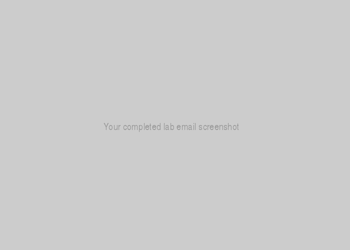

<!-- Change title below -->

# gads-2020-project-submission-template

## QwikLabs Completed

<details>
  <!-- Google Cloud Fundamentals  👇🏾-->
  <summary>Lab 1: Getting Started with BigQuery</summary>
  <!-- Provide path to the screenshot here. Example 👇🏾-->
  
</details>

<details>
  <!-- The complete lab title goes here 👇🏾-->
  <summary>Lab 2: Title Goes here</summary>
  <!-- Provide path to the screenshot here. Example 👇🏾-->
  
</details>

## Translation code

```
Your translations code can rest here
```
